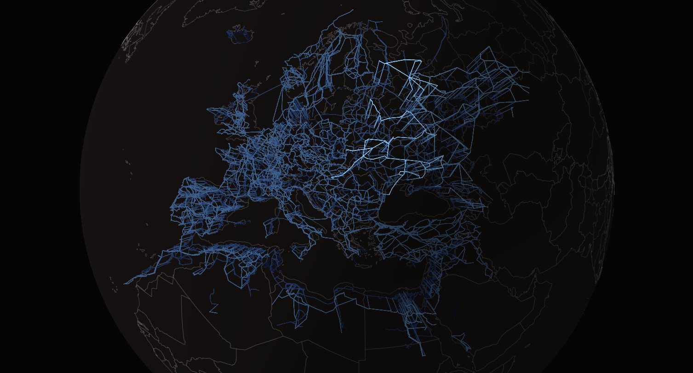

<p align="center">
  
</p>

# Latkit

[](https://github.com/lukelowry/latkit/actions/workflows/ci.yml)
[](https://latkit.readthedocs.io/en/latest/?badge=latest)

Latkit is a TypeScript package family for interactive, browser-based WebGPU visualization of network topology and time-series data.

[Documentation](https://latkit.readthedocs.io/en/latest/) &middot; [Getting started](https://latkit.readthedocs.io/en/latest/getting-started.html) &middot; [API reference](https://latkit.readthedocs.io/en/latest/api/index.html) &middot; [Examples](./examples)

## Packages

Install only the packages your application needs.

| Package                                                                | Description                                           |
| ---------------------------------------------------------------------- | ----------------------------------------------------- |
| [`@latkit/network`](https://www.npmjs.com/package/@latkit/network)     | Interactive WebGPU network topology views             |
| [`@latkit/monitor`](https://www.npmjs.com/package/@latkit/monitor)     | WebGPU time-series and signal monitor views           |
| [`@latkit/gpu`](https://www.npmjs.com/package/@latkit/gpu)             | Core WebGPU device and canvas presentation primitives |
| [`@latkit/colormaps`](https://www.npmjs.com/package/@latkit/colormaps) | Named colormaps, labels, and CSS gradient helpers     |
| [`@latkit/model`](https://www.npmjs.com/package/@latkit/model)         | Columnar network model, series, and byte form         |

## Requirements

- A WebGPU-capable browser for `@latkit/network` and `@latkit/monitor`
- An ESM-capable bundler or development server
- Node.js 24 when developing Latkit locally

## Installation

For network visualization:

```sh
npm install @latkit/gpu @latkit/network @latkit/colormaps
```

For monitor visualization:

```sh
npm install @latkit/gpu @latkit/monitor @latkit/colormaps
```

## Quick start

```ts
import { colormap } from '@latkit/colormaps';
import { requestDevice } from '@latkit/gpu';
import { createNetwork, type Topology } from '@latkit/network';

const canvas = document.querySelector<HTMLCanvasElement>('#network');
if (!canvas) {
  throw new Error('Missing #network canvas.');
}

const topology: Topology = {
  vertexCount: 3,
  vertexCoords: new Float32Array([-96, 30, -95, 31, -94, 30]),
  edges: new Uint32Array([0, 1, 1, 2]),
  polylineStart: new Uint32Array([0, 0, 0]),
};

const device = await requestDevice();
const network = await createNetwork(device, canvas, {
  colormap: colormap('viridis'),
  graticule: true,
});

network.load(topology);
network.setChannel('vertexColor', new Float32Array([0.1, 0.8, 0.4]), [0, 1]);
network.fadeIn();
```

See the [network quickstart](https://latkit.readthedocs.io/en/latest/network-quickstart.html) and [monitor quickstart](https://latkit.readthedocs.io/en/latest/monitor-quickstart.html) for complete usage and lifecycle guidance.

## Examples

Install the workspace dependencies, then run either example in a WebGPU-capable browser:

```sh
pnpm install
pnpm --filter @latkit/network-example dev
```

```sh
pnpm --filter @latkit/monitor-example dev
```

The network example runs at `http://127.0.0.1:5188`; the monitor example runs at `http://127.0.0.1:5190`.

## Documentation

The full guides and generated TypeScript API reference are published on [Read the Docs](https://latkit.readthedocs.io/en/latest/). Documentation sources live in [`docs/`](./docs) and use MyST Markdown with Sphinx.

Build the documentation locally with:

```sh
pnpm docs:build
```

## Development

```sh
pnpm install
pnpm quality
```

The `quality` command checks formatting, linting, types, and tests across the workspace. See the [release process](https://latkit.readthedocs.io/en/latest/release-process.html) for package publishing details.

## Related work

Selected related projects include:

- [`sgwt`](https://pypi.org/project/sgwt/)
- [`esapp`](https://pypi.org/project/esapp/)
- [`ORNL/GridKit`](https://github.com/ORNL/GridKit)

## Author

Latkit is developed by [Luke Lowery](https://lukelowry.github.io/) and began during his PhD studies at Texas A&M University. See his [Google Scholar profile](https://scholar.google.com/citations?user=CTynuRMAAAAJ&hl=en) for publications and the [author page](https://latkit.readthedocs.io/en/latest/about-author.html) for more information.

## License

Latkit packages are released under the [MIT License](./LICENSE).
