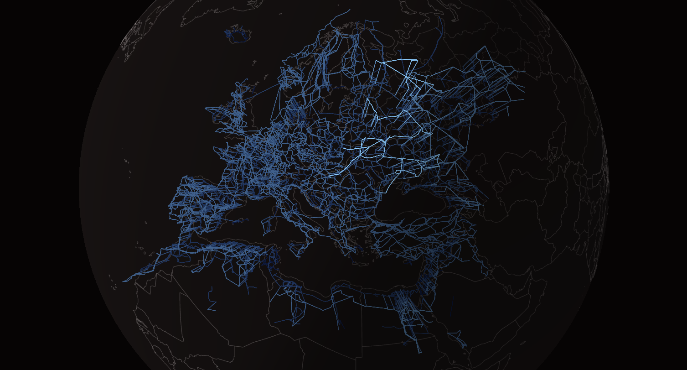

<p align="center">
  
</p>

# Latkit

[](https://github.com/lukelowry/latkit/actions/workflows/ci.yml)
[](https://latkit.readthedocs.io/en/latest/)

TypeScript tools for WebGPU network views, time-series plots, and video export.

[Documentation](https://latkit.readthedocs.io/en/latest/) ? [API reference](https://latkit.readthedocs.io/en/latest/api/index.html) ? [Examples](examples)

## Install

```sh
npm install @latkit/gpu @latkit/network
```

Use an ESM bundler and a WebGPU-capable browser. Supply your data through a
`Queryable` from [`@latkit/model`](packages/model).

## Draw a network

Here, `source` has a `node` type with a two-component `position` field and a
numeric `load` field. `canvas` is an application-owned HTML canvas with a CSS size.

```ts
import { createGpu, createCanvasView, colormaps } from '@latkit/gpu';
import { createNetwork, attachNetworkInput } from '@latkit/network';

const gpu = await createGpu();
const network = createNetwork({
  gpu,
  data: {
    source,
    coordinates: 'cartesian',
    vertices: {
      node: {
        position: 'position',
        color: { field: 'load', domain: [0, 1], colormap: colormaps.viridis },
      },
    },
  },
});
const view = createCanvasView({ gpu, canvas, renderer: network, onError: console.error });
const detach = attachNetworkInput({ network, canvas });
view.request();

// On teardown:
detach();
view.destroy();
network.destroy();
gpu.destroy();
await source.close();
```

## Packages

| Package                     | Use                                              |
| --------------------------- | ------------------------------------------------ |
| [model](packages/model)     | Data interfaces, queries, recordings, validation |
| [connect](packages/connect) | Models over workers and sockets                  |
| [gpu](packages/gpu)         | Shared rendering, fields, text, colors           |
| [network](packages/network) | Network topology and geographic views            |
| [monitor](packages/monitor) | Time-series plots and live telemetry             |
| [video](packages/video)     | MP4 and WebM export                              |
| [diagram](packages/diagram) | Planned API; private, no runtime yet             |

## Develop

Requires Node.js 24 and pnpm 10.30.

```sh
pnpm install
pnpm --filter @latkit/network-example dev
pnpm quality
pnpm build:examples
pnpm docs:build
```

See [release checks](docs/release-process.md) for browser tests and packaging.

Created by [Luke Lowery](https://lukelowry.github.io/). [MIT License](LICENSE).
